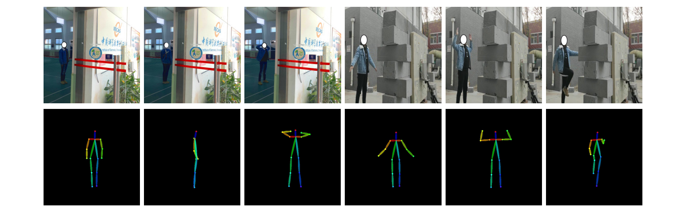

# Human Posture Reconstruction for Through-the-Wall Radar Imaging Using Convolutional Neural Networks
- [paper link](https://ieeexplore.ieee.org/document/9420808)

### 1. Introduction

- **Abstract**：Low imaging spatial resolution hinders through-the-wall radar imaging (TWRI) from reconstructing complete human postures. This letter mainly discusses a convolutional neural network (CNN)-based human posture reconstruction method for TWRI. The training process follows a supervision-prediction learning pipeline inspired by the cross-modal learning technique. Specifically, optical images and TWRI signals are collected simultaneously using a self-develop radar containing an optical camera. Then, the optical images are processed with a computer-vision-based supervision network to generate ground-truth human skeletons. Next, the same type of skeleton is predicted from corresponding TWRI signals using a prediction network. After training, the model shows complete predictions in wall-occlusive scenarios solely using TWRI signals. Experiments show comparable quantitative results with the state-of-the-art vision-based methods in nonwall-occlusive scenarios and accurate qualitative results with wall occlusion.





### 2. Installation

```
git clone https://github.com/0809zheng/RadarPose.git
cd RadarPose
pip install -r requirements.txt
```

### 3. Training

```
python train.py
```

### 4. Testing
Download pretrained model：[百度网盘(jggv)](https://pan.baidu.com/s/1NlvYjPONKEc0cLOuWdVRsg)

```
python test.py
``` 

### 5. Citations

If you find this work useful, please consider citing it.

```
@ARTICLE{9420808,
  author={Zheng, Zhijie and Pan, Jun and Ni, Zhikang and Shi, Cheng and Ye, Shengbo and Fang, Guangyou},
  journal={IEEE Geoscience and Remote Sensing Letters}, 
  title={Human Posture Reconstruction for Through-the-Wall Radar Imaging Using Convolutional Neural Networks}, 
  year={2022},
  volume={19},
  number={},
  pages={1-5},
  doi={10.1109/LGRS.2021.3073073}}
```
